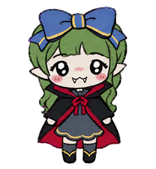
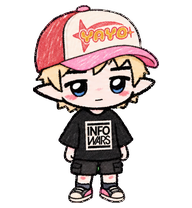
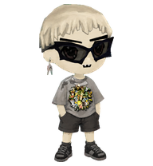
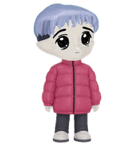
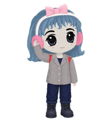
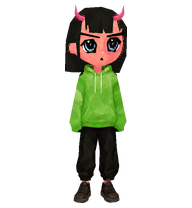
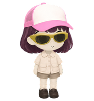
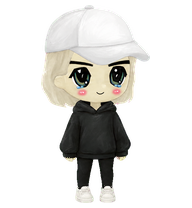
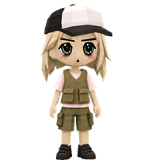

# Pet gallery

Browse every pet through a lossless, native-size PNG snapshot. Select a pet to open all nine runtime movements plus its complete sixteen-direction look sheet.

Every GIF in this gallery is deterministically rendered from the final despilled v2 atlas. Primary packages live under `pets/`; experimental packages remain under `experimental/` for testing and motion-template research.

<table>
  <tr>
    <td align="center" width="33%"><a href="mildred.md"> <strong>Mildred</strong></a> Green-haired neochibi with long braids, pointed ears, an oversized blue bow, and a black-and-red vampire cape. <em>Primary package</em></td>
    <td align="center" width="33%"><a href="remy.md"> <strong>Remy</strong></a> Rough-crayon neochibi with pink hair, pointed ears, a red-and-white cap, black graphic tee, shorts, and high-top sneakers. <em>Primary package</em></td>
    <td align="center" width="33%"><a href="wiggum.md"> <strong>Wiggum</strong></a> Blond neochibi with a bowl cut, oversized angular black sunglasses, a single fang, grey graphic tee, black shorts, and boots. <em>Primary package</em></td>
  </tr>
  <tr>
    <td align="center" width="33%"><a href="dani.md"> <strong>Dani</strong></a> Periwinkle-haired Milady with a short bowl-bob, huge glossy eyes with tear beads, a magenta puffer jacket, dark trousers, and grey shoes. <em>Primary package</em></td>
    <td align="center" width="33%"><a href="yumi.md"> <strong>Yumi</strong></a> Blue-haired Milady with a pink bow headband, fluffy pink earmuffs, grey jacket, navy trousers, and dark boots. <em>Primary package</em></td>
    <td align="center" width="33%"><a href="bremo.md"> <strong>Bremo</strong></a> Faceted Remilio-style devil girl with coral skin, a blunt black bob, pink horns, bright green hoodie, loose black trousers, and brown shoes. <em>Experimental preview</em></td>
  </tr>
  <tr>
    <td align="center" width="33%"><a href="moxie.md"> <strong>Moxie</strong></a> Coral-skinned devil girl with long black hair, pink horns, reflective black eyes, a lime hoodie, black shorts, and black shoes. <em>Experimental preview</em></td>
    <td align="center" width="33%"><a href="piko.md"> <strong>Piko</strong></a> Milady with a plum bob, pink-and-white mesh cap, mustard sunglasses, cream utility shirt and shorts, and dark shoes. <em>Experimental preview</em></td>
    <td align="center" width="33%"><a href="rizzo.md"> <strong>Rizzo</strong></a> Remilio with a red-black mullet, black-and-white mesh cap, amber sunglasses, navy tank, dark jeans, and black boots. <em>Experimental preview</em></td>
  </tr>
  <tr>
    <td align="center" width="33%"><a href="shilo.md"> <strong>Shilo</strong></a> Pale blond companion with a white cap, black hoodie, black bottoms, and white sneakers. <em>Experimental preview</em></td>
    <td align="center" width="33%"><a href="tavi-3d.md"> <strong>Tavi</strong></a> Low-poly 3D Remilio with pale blond hair, black-and-white mesh cap, pink shirt, olive utility vest and shorts, and dark boots. <em>Experimental preview</em></td>
    <td align="center" width="33%"><a href="velo.md"> <strong>Velo</strong></a> White-haired Remilio in a yellow cycling helmet, white jersey, black cycling shorts, and yellow-black shoes. <em>Experimental preview</em></td>
  </tr>
  <tr>
    <td align="center" width="33%"><a href="zimbo.md"> <strong>Zimbo</strong></a> Grey-skinned Remilio with white hair, a conical straw hat, round dark glasses, patterned rust shirt, black shorts, and sandals. <em>Experimental preview</em></td>
  </tr>
</table>

## Create your own

Start with the [PFP-to-pet guide](../docs/create-your-own-pet.md), which includes the Remilia maker links, a copy-paste Codex prompt, motion planning, review profiles, and installation instructions.

