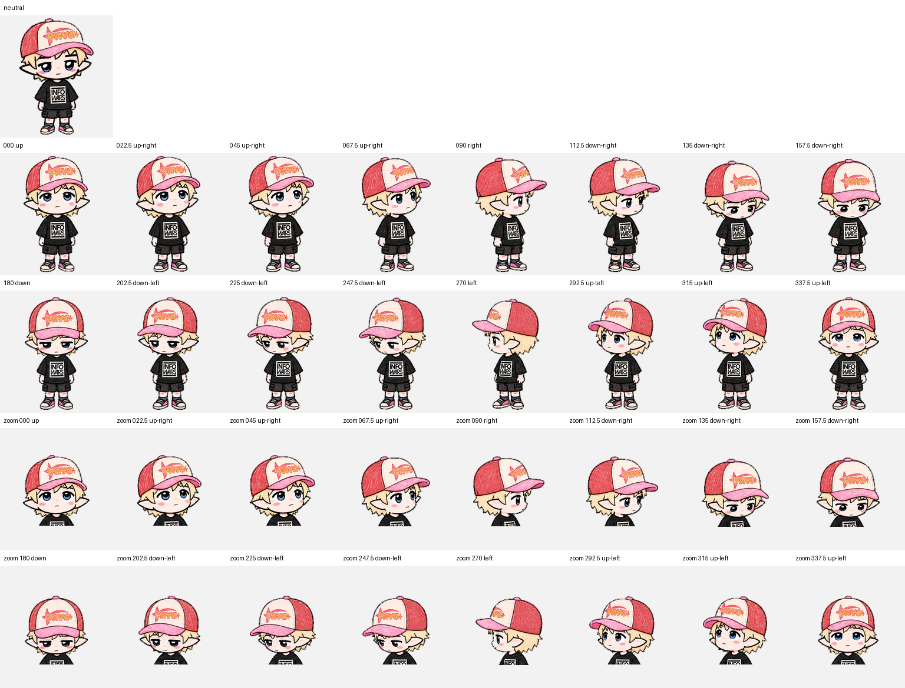

# Remy

[Back to the complete pet gallery](README.md)

A relaxed, loyal, quietly mischievous rough-crayon neochibi companion.

**Package:** [Primary v2 package](../pets/remy/)

The animations below are displayed at their native 192x208-pixel cell size and were rendered directly from the final despilled atlas.

<table>
  <tr>
    <td align="center" width="33%"><strong>Idle</strong> </td>
    <td align="center" width="33%"><strong>Move right</strong> </td>
    <td align="center" width="33%"><strong>Move left</strong> </td>
  </tr>
  <tr>
    <td align="center" width="33%"><strong>Greeting</strong> </td>
    <td align="center" width="33%"><strong>Jumping</strong> </td>
    <td align="center" width="33%"><strong>Failed / recovery</strong> </td>
  </tr>
  <tr>
    <td align="center" width="33%"><strong>Waiting</strong> </td>
    <td align="center" width="33%"><strong>Active work</strong> </td>
    <td align="center" width="33%"><strong>Review</strong> </td>
  </tr>
</table>

## Look directions

[Open the complete contact sheet](../previews/remy/contact-sheet.png)

